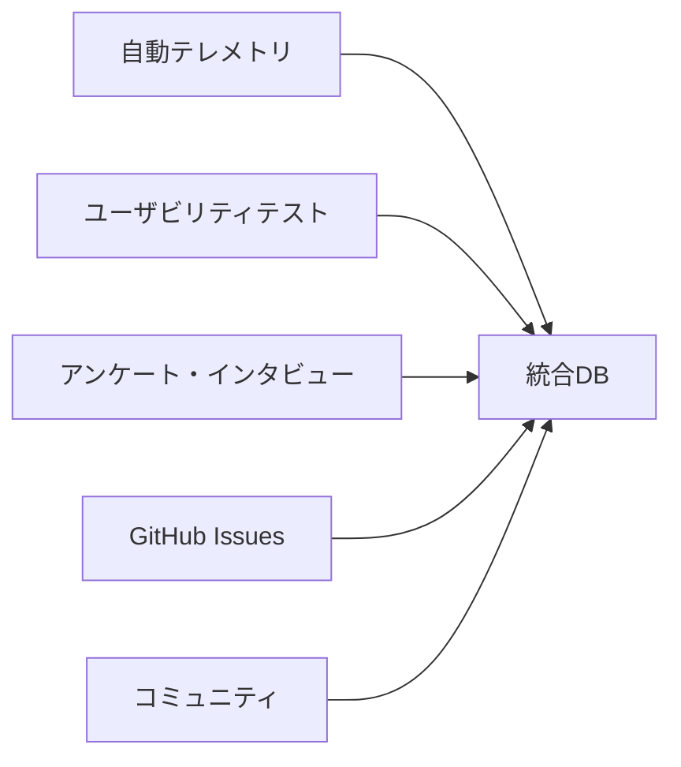
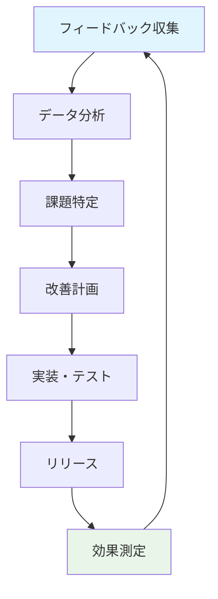

# 📊 ユーザーフィードバック収集計画

> v2.0テンプレートの改善とユーザー満足度向上のための包括的フィードバック戦略

## 🎯 フィードバック収集の目的

1. **使いやすさの検証**: セットアップの簡単さ、エラーの少なさ
2. **機能ギャップの特定**: 現行版から移行時の不足機能
3. **ドキュメント改善**: 分かりにくい部分の特定
4. **優先機能の決定**: 次期バージョンの開発方針

## 📋 収集方法と実装

### 1. 自動フィードバック収集

#### セットアップ成功率の追跡
```javascript
// easy-setup.js に追加
class FeedbackCollector {
  async trackSetupSuccess(config) {
    const data = {
      timestamp: new Date().toISOString(),
      success: true,
      setupTime: this.setupStartTime ? Date.now() - this.setupStartTime : null,
      userType: 'new', // new, existing, migration
      platform: process.platform,
      nodeVersion: process.version
    };
    
    // 匿名でテレメトリ送信（opt-in）
    if (config.allowTelemetry) {
      await this.sendTelemetry(data);
    }
  }
}
```

#### ビルド成功率の追跡
```javascript
// scripts/build-simple.js に追加
class BuildMetrics {
  async trackBuild(startTime, success, errorType = null) {
    const metrics = {
      buildTime: Date.now() - startTime,
      success,
      errorType,
      filesProcessed: this.processedFiles,
      platform: process.platform
    };
    
    await this.saveMetrics(metrics);
  }
}
```

### 2. ユーザビリティテスト

#### 新規ユーザー向けテスト
```markdown
## テストシナリオ1: 初回セットアップ

**参加者**: GitHubアカウントを持つ非技術者5名

**タスク**
1. テンプレートをクローン
2. セットアップを完了
3. サンプル記事を追加
4. ローカルプレビューで確認
5. GitHubにデプロイ

**測定項目**
- 完了時間
- エラー発生箇所
- 質問・困った点
- 満足度（1-10）
```

#### 既存ユーザー向け移行テスト
```markdown
## テストシナリオ2: 現行版からの移行

**参加者**: 現行テンプレート利用者3名

**タスク**
1. 既存プロジェクトのバックアップ
2. v2.0への移行実行
3. 機能差分の確認
4. 移行完了

**測定項目**
- 移行時間
- データ損失の有無
- 機能不足の指摘
- 移行満足度
```

### 3. アンケート・インタビュー

#### 継続利用アンケート
```markdown
## 月次アンケート（利用者向け）

### 基本情報
- 利用期間: [ 1週間未満 / 1週間-1ヶ月 / 1-3ヶ月 / 3ヶ月以上 ]
- プロジェクト規模: [ 小（10章未満） / 中（10-50章） / 大（50章以上） ]
- 技術レベル: [ 初心者 / 中級者 / 上級者 ]

### 満足度評価（1-5点）
- セットアップの簡単さ: [   ]
- ビルド速度: [   ]
- エラーメッセージの分かりやすさ: [   ]
- ドキュメントの充実度: [   ]
- 全体的な満足度: [   ]

### 自由記述
- 最も気に入っている機能
- 最も困っている点
- 追加して欲しい機能
- 改善提案
```

#### 深堀りインタビュー
```markdown
## 四半期インタビュー

**対象**: ヘビーユーザー2-3名
**時間**: 30-45分
**形式**: オンライン1on1

**質問項目**
1. 日常的な使用パターン
2. 現行版との比較感想
3. ワークフロー上の課題
4. 求める新機能の詳細
5. 他ツールとの比較
```

### 4. GitHub Issues・Discussions分析

#### 自動分類システム
```javascript
// GitHub Issues の分析
const IssueAnalyzer = {
  categories: {
    'setup-problem': ['setup', 'install', 'configuration'],
    'build-error': ['build', 'compile', 'error'],
    'documentation': ['docs', 'guide', 'help'],
    'feature-request': ['feature', 'enhancement', 'add'],
    'bug': ['bug', 'issue', 'problem', 'broken']
  },
  
  analyzeIssue(title, body, labels) {
    // 自動分類とトレンド分析
    return {
      category: this.detectCategory(title, body),
      severity: this.assessSeverity(labels),
      responseTime: this.calculateResponseTime(),
      resolution: this.trackResolution()
    };
  }
};
```

### 5. コミュニティフィードバック

#### Discord/Slack チャンネル
```markdown
## Book Publishing Template ユーザーコミュニティ

**チャンネル構成**
- #general: 一般的な質問・雑談
- #v2-feedback: v2.0への感想・改善提案
- #showcase: 作成した書籍の紹介
- #tips-tricks: 使い方のコツ共有
- #migration: 移行に関する相談

**モデレーション**
- 週1回のまとめレポート作成
- よくある質問のFAQ化
- 建設的な提案の Issues 化
```

## 📊 データ分析・レポート

### 週次レポート
```markdown
## 週次フィードバックサマリー

### 量的データ
- 新規セットアップ数: XX件
- セットアップ成功率: XX%
- 平均セットアップ時間: XX分
- ビルド成功率: XX%
- Issue件数: XX件（前週比±XX%）

### 質的データ
- 主要なフィードバックテーマ
- 緊急度の高い問題
- 高評価された機能
- 改善要望TOP3
```

### 月次分析レポート
```markdown
## 月次改善アクションプラン

### 優先改善項目
1. **セットアップエラー削減**
   - 現状: 5%のエラー率
   - 目標: 2%以下
   - アクション: エラーハンドリング強化

2. **ドキュメント改善**
   - 現状: よくある質問が多い
   - 目標: 自己解決率80%
   - アクション: FAQ・チュートリアル強化

### 新機能開発優先度
1. PDF自動生成（要望多数）
2. テーマカスタマイズ（中級ユーザー要望）
3. プラグインシステム（上級ユーザー要望）
```

## 🎯 フィードバック活用プロセス

### 1. 収集（Collection）


### 2. 分析（Analysis）
```javascript
// フィードバック分析パイプライン
const FeedbackAnalyzer = {
  async processFeedback() {
    const data = await this.collectAllSources();
    
    return {
      quantitative: this.analyzeMetrics(data),
      qualitative: this.categorizeComments(data),
      trends: this.identifyTrends(data),
      priorities: this.calculatePriorities(data)
    };
  }
};
```

### 3. 行動（Action）
```markdown
## 改善アクションの種類

### 即座に対応（24-48時間）
- 重大なバグ修正
- セットアップブロッカーの解決
- ドキュメントの誤り修正

### 短期対応（1-2週間）
- マイナーな機能改善
- エラーメッセージの改善
- FAQ追加

### 中期対応（1-3ヶ月）
- 新機能追加
- パフォーマンス改善
- 大幅なドキュメント改善

### 長期対応（3ヶ月以上）
- アーキテクチャ変更
- 大規模機能追加
- エコシステム拡張
```

## 📈 成功指標（KPI）

### ユーザー満足度
- [ ] 総合満足度: 4.5/5.0以上
- [ ] セットアップ満足度: 4.7/5.0以上
- [ ] サポート満足度: 4.3/5.0以上

### 技術指標
- [ ] セットアップ成功率: 95%以上
- [ ] ビルド成功率: 98%以上
- [ ] 平均Issue解決時間: 24時間以内

### 成長指標
- [ ] 月次新規ユーザー数: 前月比+20%
- [ ] ユーザー継続率: 80%以上
- [ ] コミュニティ活動: 週10投稿以上

## 🔄 継続改善サイクル



### 週次レビュー
- フィードバック集約
- 緊急課題の特定
- 対応方針決定

### 月次レビュー
- KPI達成状況確認
- 改善効果測定
- 次月計画策定

### 四半期レビュー
- 戦略見直し
- ロードマップ更新
- リソース配分調整

---

**📝 このフィードバック収集計画により、ユーザー中心の継続的改善を実現し、最高の書籍出版体験を提供します。**