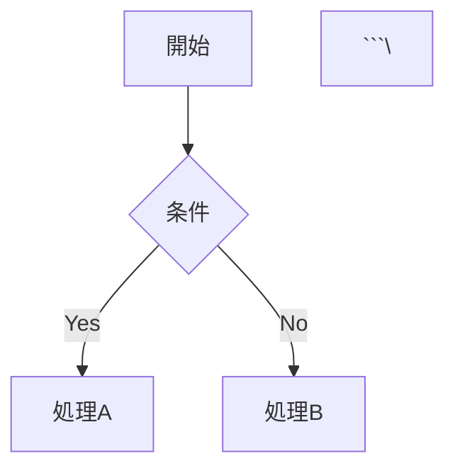

# 🚀 Quick Start Guide - 5分で始める書籍出版

> **改善版テンプレート**: 複雑な設定を自動化し、すぐに執筆を開始できます

## ⚡ 超高速セットアップ

### Step 1: テンプレートをクローン

```bash
git clone https://github.com/itdojp/book-publishing-template2.git my-book
cd my-book
```

### Step 2: 自動セットアップ実行

```bash
# Node.js 18以上が必要
node easy-setup.js
```

**質問に答えるだけ**: 書籍タイトル、著者名、GitHubユーザー名を入力

### Step 3: ビルドテスト

```bash
npm run build
npm run preview
```

ブラウザで http://localhost:8080 を開いて確認

### Step 4: GitHubへプッシュ

```bash
git add -A
git commit -m "Initial commit"
# GitHubでリポジトリを作成後
# git remote add origin https://github.com/yourusername/my-book.git
git push -u origin main
```

### Step 5: GitHub Pages設定（1分）

1. GitHubのリポジトリページを開く
2. **Settings** > **Pages** へ移動
3. **Source**: Deploy from a branch
4. **Branch**: main, **Folder**: /docs
5. **Save** をクリック

**完了！** 数分後に `https://yourusername.github.io/my-book/` でアクセス可能

---

## 📝 執筆開始

### ディレクトリ構造

```
my-book/
├── src/
│   ├── introduction/index.md    # はじめに
│   └── chapters/
│       └── chapter01/index.md   # 第1章
├── assets/images/               # 画像
└── book-config.json            # 設定
```

### 新しい章を追加

```bash
mkdir src/chapters/chapter02
echo "# 第2章 応用編

詳細な内容..." > src/chapters/chapter02/index.md
```

### 数式を追加

```markdown
$$E = mc^2$$

インライン数式: $x = \frac{-b \pm \sqrt{b^2-4ac}}{2a}$
```

### 図表を追加

```markdown


---

## 🔄 日常ワークフロー

### 1. 執筆

```bash
# ファイルを編集
vim src/chapters/chapter01/index.md
```

### 2. プレビュー

```bash
npm run preview
# http://localhost:8080 で確認
```

### 3. 公開

```bash
npm run build  # docs/フォルダにビルド
git add .
git commit -m "Add new content"
git push

# GitHub Actionsで自動ビルド（オプション）
```

---

## ❓ トラブルシューティング

### ビルドエラー

```bash
npm run clean
npm run build
```

### GitHub Pagesが表示されない

1. Settings > Pages で設定を確認
2. Branch: main, Folder: /docs が選択されているか確認
3. ビルド後に`docs/`フォルダがコミットされているか確認

### プレビューが表示されない

```bash
# ポート8080が使用中の場合
npx http-server docs -p 3000
```

---

## 📚 さらに詳しく

- **完全ガイド**: [README.md](README.md)
- **リポジトリ構成**: [REPOSITORY-ACCESS-GUIDE.md](REPOSITORY-ACCESS-GUIDE.md)
- **設定詳細**: [book-config.json](book-config.json)
- **サポート**: [Issues](https://github.com/itdojp/book-publishing-template2/issues)

---

## 🎯 改善ポイント

このテンプレートの改善点は次のとおりです。

- ✅ **1コマンドセットアップ**: `node easy-setup.js`
- ✅ **軽量ビルド**: 重い依存関係を排除
- ✅ **明確なエラーメッセージ**: 問題箇所が分かりやすい
- ✅ **自動設定生成**: 手動設定を最小化
- ✅ **段階的セットアップ**: 必要な時に高度な機能を追加

**Happy Writing! 📖✨**
