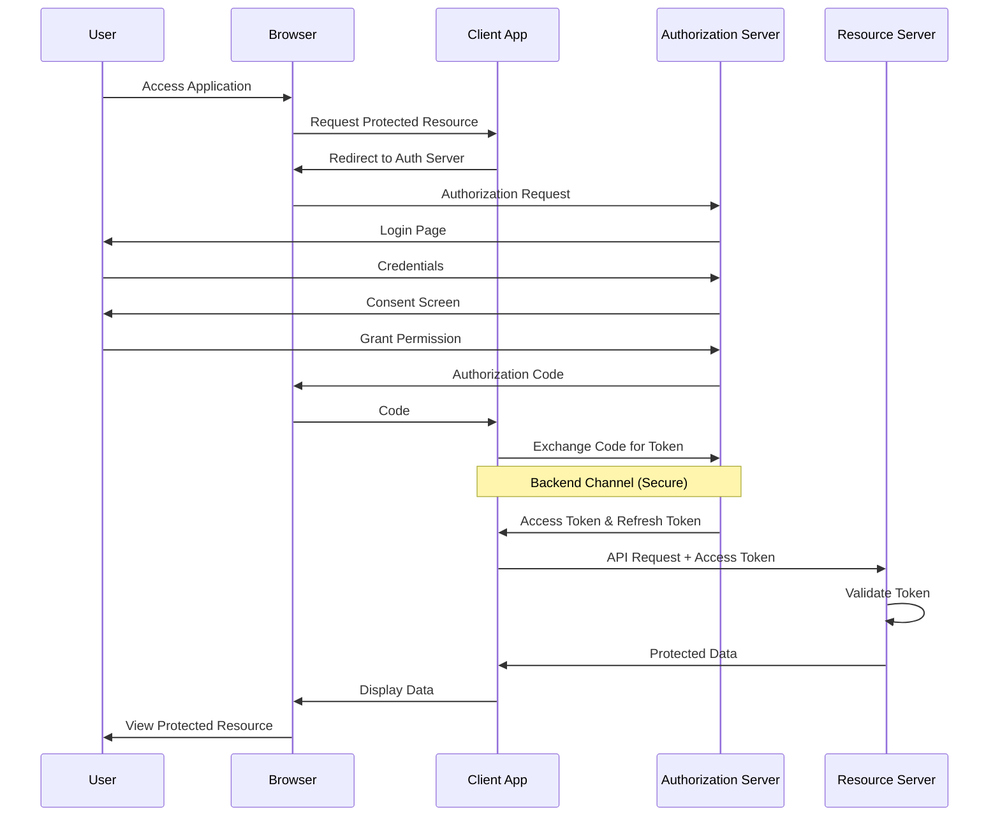
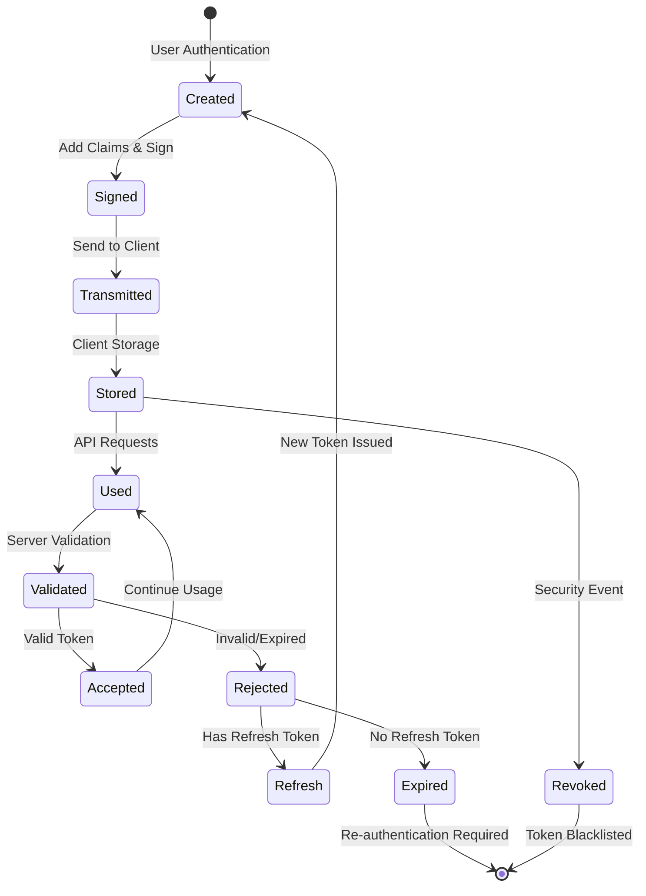
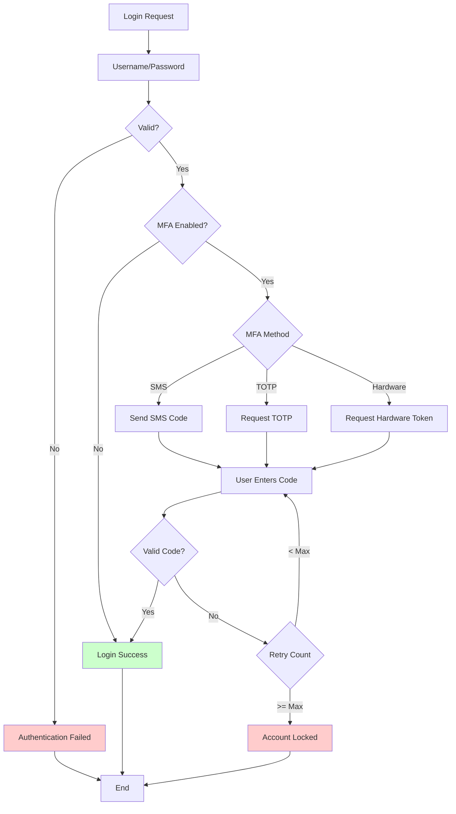
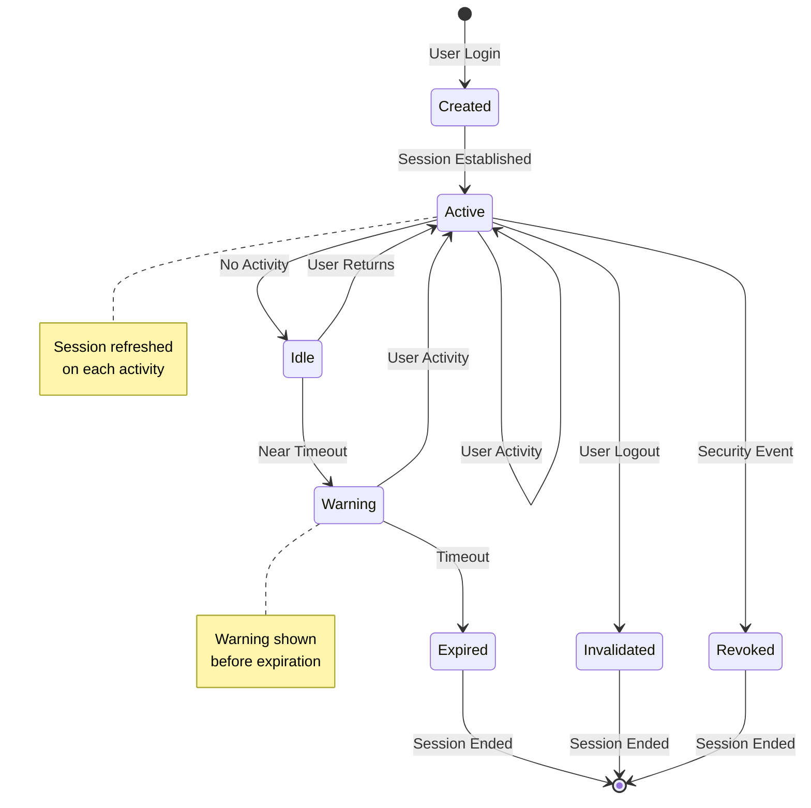
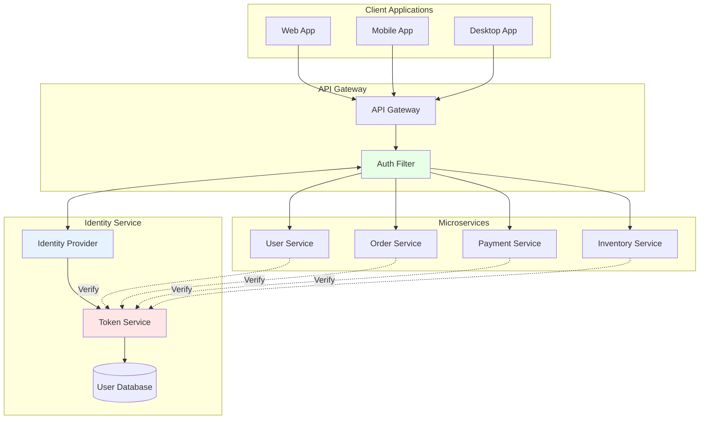

# Authentication and Authorization Flow Diagrams

## OAuth 2.0 Authorization Code Flow

## JWT Token Lifecycle

## Multi-Factor Authentication Flow

## Session Management State Diagram

## Microservices Authentication Architecture

