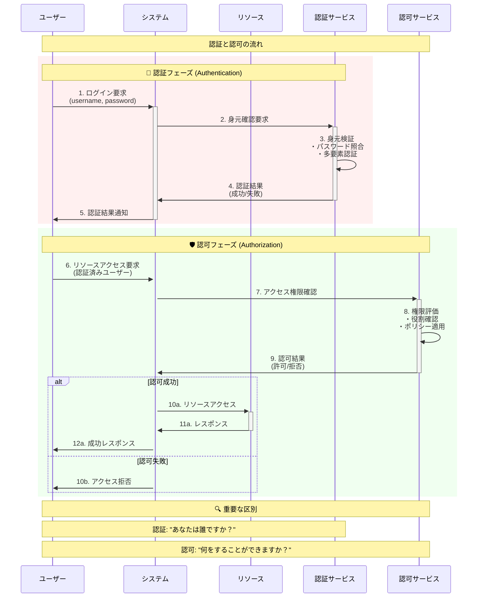
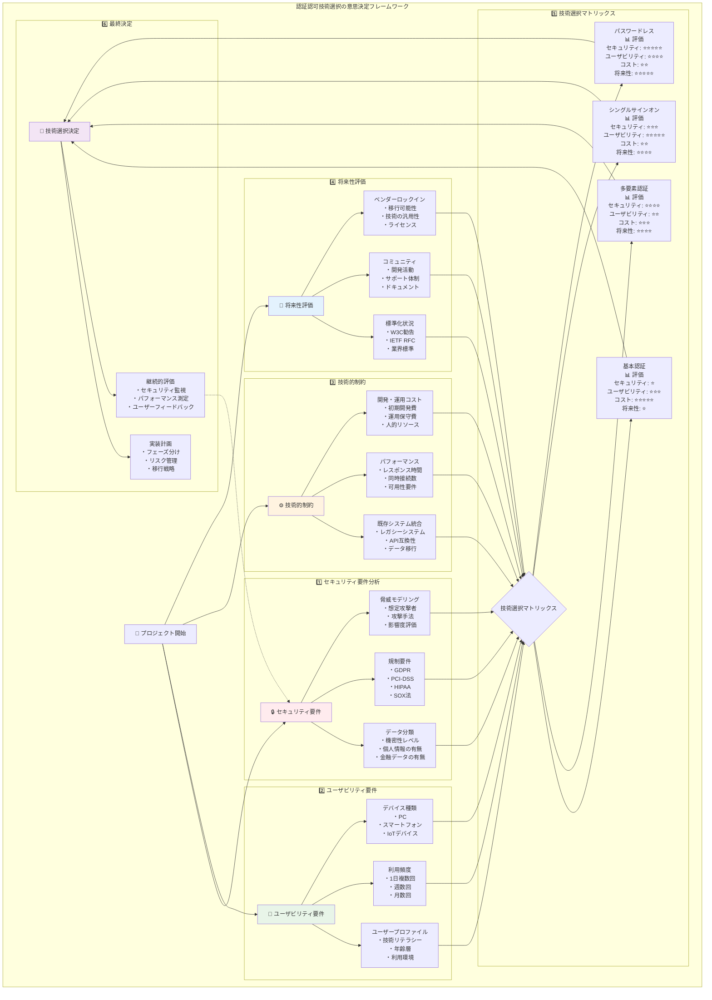

# 第1章 認証認可の全体像

## なぜこの章が重要か

システム開発において、認証認可は避けて通れない基本機能です。しかし、多くの開発者が「とりあえず動けばいい」という実装に陥り、後になってセキュリティインシデントや大規模な改修に直面します。この章では、認証認可がなぜ必要なのか、どのような価値を提供するのかを理解し、本書全体の学習の道筋を明確にします。

## 1.1 なぜ認証認可が必要か - ビジネスリスクとセキュリティの観点

### 1.1.1 ビジネスにおける認証認可の価値

認証認可システムは、単なる「ログイン機能」ではありません。それは組織の資産を守り、ビジネスを成長させるための基盤です。

**実例：あるECサイトの事故**

2023年、ある中規模ECサイトで発生した事故を考えてみましょう。このサイトは「簡単な会員機能」として、メールアドレスとパスワードのみの認証を実装していました。

```
被害の概要：
- 不正アクセスによる個人情報流出：10万件
- 直接的な損害賠償：5億円
- ブランド価値の毀損：計測不能
- 復旧にかかった期間：3ヶ月
- 失った顧客の信頼：回復に2年以上
```

この事故の根本原因は以下でした：

1. **脆弱なパスワードポリシー**：最小文字数のみの制限
2. **多要素認証の欠如**：パスワードのみの単一要素認証
3. **不適切なセッション管理**：セッション固定攻撃への脆弱性
4. **認可の不備**：一般ユーザーが管理機能にアクセス可能

### 1.1.2 認証認可が解決する4つの根本的な問題

```mermaid
graph TB
    subgraph "認証認可が解決する根本的な問題"
        subgraph "1. アイデンティティの問題"
            Q1[❓ あなたは誰？]
            P1[🔐 デジタル世界での身元確認<br/><br/>【現実世界の例え】<br/>・銀行窓口: 通帳+印鑑<br/>・空港: パスポート+顔認証<br/><br/>【デジタル世界】<br/>・ID/パスワード<br/>・生体認証<br/>・多要素認証]
        end
        
        subgraph "2. 権限の問題"
            Q2[❓ 何ができる？]
            P2[👥 役割に応じた権限管理<br/><br/>【一般社員】<br/>・自分のデータ閲覧・編集<br/>・共有リソース閲覧<br/><br/>【マネージャー】<br/>・チームデータ閲覧<br/>・承認権限<br/><br/>【管理者】<br/>・システム設定変更<br/>・全データアクセス]
        end
        
        subgraph "3. 責任追跡の問題"
            Q3[❓ 誰が何をした？]
            P3[📋 監査ログとアカウンタビリティ<br/><br/>【重要性】<br/>・不正の抑止力<br/>・インシデント原因究明<br/>・法的要求への対応<br/>・コンプライアンス対応<br/><br/>【記録内容】<br/>・Who: 実行者<br/>・What: 実行内容<br/>・When: 実行時刻<br/>・Where: アクセス元]
        end
        
        subgraph "4. 利便性の問題"
            Q4[❓ 毎回認証は面倒]
            P4[⚖️ セキュリティと利便性のバランス<br/><br/>【利便性向上施策】<br/>・シングルサインオン (SSO)<br/>・リメンバーミー機能<br/>・生体認証の活用<br/>・段階的認証<br/><br/>【セキュリティ強化】<br/>・リスクベース認証<br/>・適応的認証<br/>・時間制限つきセッション]
        end
        
        Q1 --> P1
        Q2 --> P2
        Q3 --> P3
        Q4 --> P4
        
        subgraph "統合的な解決策"
            Solution[🎯 現代の認証認可システム<br/><br/>【包括的アプローチ】<br/>・統合ID管理 (IAM)<br/>・Zero Trust Architecture<br/>・継続的認証・認可<br/>・AI/ML活用のリスク評価<br/><br/>【ビジネス価値】<br/>・セキュリティリスク軽減<br/>・運用コスト削減<br/>・ユーザーエクスペリエンス向上<br/>・コンプライアンス確保]
        end
        
        P1 --> Solution
        P2 --> Solution
        P3 --> Solution  
        P4 --> Solution
    end
    
    style Q1 fill:#ffebee
    style Q2 fill:#fff3e0
    style Q3 fill:#e8f5e8
    style Q4 fill:#e3f2fd
    style Solution fill:#f3e5f5
```

#### 1. アイデンティティの問題：「あなたは誰？」

デジタル世界では、相手の顔が見えません。認証は、デジタル世界における「身分証明書」の役割を果たします。

**現実世界の例え**：
- 銀行の窓口では、通帳と印鑑で本人確認
- デジタル世界では、ID/パスワードや生体認証で本人確認

#### 2. 権限の問題：「何ができる？」

組織には様々な役割があり、それぞれに適切な権限があります。認可は、この権限管理をシステム化します。

**組織における権限の例**：
```
一般社員：
- 自分のデータの閲覧・編集
- 共有リソースの閲覧

マネージャー：
- チームメンバーのデータ閲覧
- 承認権限

管理者：
- システム設定の変更
- 全データへのアクセス
```

#### 3. 責任追跡の問題：「誰が何をした？」

コンプライアンスや内部統制の観点から、「誰が、いつ、何をしたか」を記録することは必須です。

**監査ログの重要性**：
- 不正の抑止力
- インシデント発生時の原因究明
- 法的要求への対応

#### 4. 利便性の問題：「毎回認証は面倒」

セキュリティと利便性は常にトレードオフの関係にあります。適切な認証認可システムは、このバランスを最適化します。

**利便性向上の施策**：
- シングルサインオン（SSO）
- リメンバーミー機能
- 生体認証の活用

### 1.1.3 認証認可への投資対効果

認証認可システムへの投資は、以下のような明確なROIをもたらします：

**コスト削減効果**：
1. **セキュリティインシデントの予防**
   - データ漏洩による賠償金：平均1件あたり4.5億円（2024年調査）
   - 適切な認証認可により90%以上のインシデントが予防可能

2. **運用コストの削減**
   - パスワードリセット対応：1件あたり約3,000円
   - セルフサービス化により80%削減可能

3. **コンプライアンス対応**
   - GDPR違反の制裁金：最大で年間売上の4%
   - 適切な認証認可は必須要件

**ビジネス価値の向上**：
1. **顧客満足度の向上**
   - SSO導入により、ログイン時間を90%短縮
   - 生体認証により、パスワード忘れによる離脱を防止

2. **新規ビジネスの実現**
   - B2B連携における信頼性の確保
   - APIエコノミーへの参加

## 1.2 基本用語と概念の整理 - 混同されやすい用語の明確な区別

### 1.2.1 認証（Authentication）と認可（Authorization）の違い

多くの開発者が混同するこの2つの概念を、明確に区別しましょう。



#### 認証（Authentication）- "AuthN"

**定義**：利用者が主張する身元（アイデンティティ）が正しいことを確認するプロセス

**日常での例え**：
```
空港のセキュリティチェック
1. パスポートの提示（身元の主張）
2. 顔写真との照合（認証）
3. 本人であることの確認完了
```

**システムでの実装例**：
```python
def authenticate(username, password):
    """ユーザーの身元を確認する"""
    user = get_user_by_username(username)
    if user and verify_password(password, user.password_hash):
        return user  # 認証成功
    return None  # 認証失敗
```

#### 認可（Authorization）- "AuthZ"

**定義**：認証されたユーザーが、特定のリソースや操作に対してアクセス権限を持っているかを判定するプロセス

**日常での例え**：
```
ホテルのカードキー
1. フロントで本人確認（認証済み）
2. 部屋番号に応じたカードキー発行（権限付与）
3. 自分の部屋のみ開錠可能（認可）
```

**システムでの実装例**：
```python
def authorize(user, resource, action):
    """ユーザーのアクセス権限を確認する"""
    permissions = get_user_permissions(user)
    return has_permission(permissions, resource, action)
```

### 1.2.2 その他の重要な用語

#### アイデンティティ（Identity）

**定義**：システム内でエンティティを一意に識別する属性の集合

**構成要素**：
- 識別子（ID、メールアドレスなど）
- 属性（名前、所属、役職など）
- クレデンシャル（パスワード、証明書など）

#### プリンシパル（Principal）

**定義**：認証されたエンティティを表す概念。ユーザー、サービス、デバイスなどを含む

```java
// Javaでの例
Principal principal = request.getUserPrincipal();
String username = principal.getName();
```

#### セッション（Session）

**定義**：認証後の一連のインタラクションを管理する仕組み

**重要な属性**：
- セッションID：一意の識別子
- 有効期限：セキュリティのため必須
- 関連データ：ユーザー情報、権限など

#### トークン（Token）

**定義**：認証・認可の情報を含む、検証可能なデータ構造

**種類**：
1. **参照トークン（Opaque Token）**
   - ランダムな文字列
   - サーバー側で意味を解決

2. **自己完結型トークン（Self-contained Token）**
   - JWT（JSON Web Token）が代表例
   - トークン自体に情報を含む

### 1.2.3 混同を避けるための実践的なガイドライン

**チェックリスト形式での理解**：

```
□ ログイン処理 → 認証（Authentication）
□ 「このボタンを押せるか」の判定 → 認可（Authorization）
□ 「誰であるか」の情報 → アイデンティティ（Identity）
□ 「ログイン中の人」を表す → プリンシパル（Principal）
□ ログイン状態の管理 → セッション（Session）
□ 認証情報の持ち運び → トークン（Token）
```

## 1.3 歴史的経緯と現在のトレンド - 技術選択の判断基準

### 1.3.1 認証技術の進化

認証技術の歴史を理解することで、なぜ現在の技術が生まれたのか、次に何が来るのかが見えてきます。

```mermaid
timeline
    title 認証技術の歴史的進化
    
    section 第1世代: パスワードのみ (1960年代～)
        1960s : メインフレーム時代
              : 限られたユーザー
              : 平文パスワード保存
        問題点 : 総当たり攻撃への脆弱性
              : パスワードの使い回し
              : セキュリティ意識の不足
    
    section 第2世代: 暗号化・ハッシュ化 (1970年代～)
        1970s : Unix crypt()関数
              : 可逆暗号化の試み
        1990s : MD5ハッシュ化
              : ソルトの概念導入
        2000s : SHA-1, SHA-256
              : bcrypt (計算量的安全性)
        現在  : Argon2 (推奨)
              : scrypt (代替案)
    
    section 第3世代: 多要素認証 (2000年代～)
        2000s : RSA SecurID
              : ハードウェアトークン
        2005  : SMS認証の普及
              : 携帯電話の普及と連動
        2010  : TOTP/HOTP標準化
              : Google Authenticator
        2015  : プッシュ通知認証
              : スマートフォンアプリ活用
    
    section 第4世代: 生体認証 (2010年代～)
        2013  : iPhone 5s Touch ID
              : 指紋認証の民主化
        2017  : iPhone X Face ID
              : 3D顔認証技術
        2018  : Android指紋認証標準化
              : Windows Hello普及
        現在  : 行動的生体認証研究
              : 歩行パターン・タイピング
    
    section 第5世代: パスワードレス (2020年代～)
        2018  : FIDO2/WebAuthn標準化
              : W3C勧告
        2020  : Microsoft Passwordless
              : 企業導入加速
        2021  : Apple Passkeys
              : デバイス間同期
        2022  : Google Passkeys
              : クロスプラットフォーム
        未来  : Quantum-Safe認証
              : 分散アイデンティティ
```

#### 第1世代：パスワードのみの時代（1960年代～）

**背景**：メインフレーム時代、限られた人だけがコンピュータを使用

**問題点**：
- 平文保存によるリスク
- 総当たり攻撃への脆弱性
- パスワードの使い回し

#### 第2世代：暗号化とハッシュ化（1970年代～）

**技術革新**：
```
平文パスワード → MD5 → SHA-1 → bcrypt → Argon2
```

**学んだ教訓**：
- 可逆暗号化では不十分
- ソルトの重要性
- 計算量的安全性の必要性

#### 第3世代：多要素認証の登場（2000年代～）

**きっかけ**：大規模な情報漏洩事件の頻発

**実装方式の進化**：
1. ハードウェアトークン（RSA SecurID）
2. SMS認証
3. TOTP/HOTP（Google Authenticator）
4. プッシュ通知認証

#### 第4世代：生体認証の普及（2010年代～）

**技術の民主化**：
- スマートフォンへの指紋センサー搭載
- 顔認証（Face ID）の登場
- 行動的生体認証の研究

#### 第5世代：パスワードレスへの移行（2020年代～）

**FIDO2/WebAuthnの登場**：
```javascript
// パスワードレス認証の例
navigator.credentials.create({
    publicKey: {
        challenge: new Uint8Array(32),
        rp: { name: "Example Corp" },
        user: {
            id: new TextEncoder().encode("user@example.com"),
            name: "user@example.com",
            displayName: "User Name"
        },
        pubKeyCredParams: [{alg: -7, type: "public-key"}],
        authenticatorSelection: {
            authenticatorAttachment: "platform"
        }
    }
});
```

### 1.3.2 認可モデルの進化

```mermaid
graph TD
    subgraph "認可モデルの進化"
        subgraph "ACL: Access Control List (1970年代～)"
            ACL[リソース中心の権限管理]
            ACLExample[file.txt:<br/>- user1: read, write<br/>- user2: read<br/>- user3: no access]
            ACLPros[👍 シンプル<br/>👍 直感的<br/>👍 実装が容易]
            ACLCons[👎 スケールしない<br/>👎 管理コストが高い<br/>👎 継承ができない]
        end
        
        subgraph "RBAC: Role-Based Access Control (1990年代～)"
            RBAC[役割による権限管理]
            RBACExample[User → Role → Permission<br/>John → Editor → [create_post, edit_post]<br/>Jane → Viewer → [view_post]]
            RBACPros[👍 管理が容易<br/>👍 職務分離<br/>👍 継承可能]
            RBACCons[👎 複雑な条件を表現困難<br/>👎 役割爆発の問題<br/>👎 動的制御が困難]
        end
        
        subgraph "ABAC: Attribute-Based Access Control (2000年代～)"
            ABAC[属性ベースの柔軟制御]
            ABACExample[if (user.department == 'HR' &&<br/>resource.type == 'employee_data' &&<br/>time.hour >= 9 && time.hour <= 18)]
            ABACPros[👍 非常に柔軟<br/>👍 文脈を考慮<br/>👍 動的制御]
            ABACCons[👎 設計が複雑<br/>👎 パフォーマンス課題<br/>👎 デバッグ困難]
        end
        
        subgraph "PBAC: Policy-Based Access Control (2010年代～)"
            PBAC[宣言的ポリシー記述]
            PBACExample[# OPA (Open Policy Agent)<br/>allow {<br/>  input.method = 'GET'<br/>  input.path = ['api', 'users', user_id]<br/>  input.user.id = user_id<br/>}]
            PBACPros[👍 宣言的記述<br/>👍 バージョン管理可能<br/>👍 テスト可能]
            PBACCons[👎 学習コストが高い<br/>👎 ツール依存<br/>👎 運用コストが高い]
        end
        
        ACL --> RBAC
        RBAC --> ABAC
        ABAC --> PBAC
        
        ACL --> ACLExample
        ACL --> ACLPros
        ACL --> ACLCons
        
        RBAC --> RBACExample
        RBAC --> RBACPros
        RBAC --> RBACCons
        
        ABAC --> ABACExample
        ABAC --> ABACPros
        ABAC --> ABACCons
        
        PBAC --> PBACExample
        PBAC --> PBACPros
        PBAC --> PBACCons
        
        subgraph "現代のハイブリッドアプローチ"
            Modern[🎯 実用的な組み合わせ<br/><br/>・基本権限: RBAC<br/>・動的制御: ABAC<br/>・ポリシー管理: PBAC<br/>・リソース固有: ACL<br/><br/>【選択基準】<br/>・システムの複雑さ<br/>・管理コスト<br/>・パフォーマンス要件<br/>・セキュリティ要件]
        end
        
        ACL -.-> Modern
        RBAC -.-> Modern
        ABAC -.-> Modern
        PBAC -.-> Modern
    end
    
    style ACL fill:#ffe0e0
    style RBAC fill:#e0ffe0
    style ABAC fill:#e0e0ff
    style PBAC fill:#ffe0ff
    style Modern fill:#fff2e0
```

#### ACL（Access Control List）

**時代**：1970年代～
**特徴**：リソース中心の単純なモデル
```
file.txt:
  - user1: read, write
  - user2: read
  - user3: no access
```

#### RBAC（Role-Based Access Control）

**時代**：1990年代～
**特徴**：役割による権限管理
```
User → Role → Permission
John → Editor → [create_post, edit_post, delete_post]
Jane → Viewer → [view_post]
```

#### ABAC（Attribute-Based Access Control）

**時代**：2000年代～
**特徴**：柔軟な属性ベース制御
```
if (user.department == "HR" && 
    resource.type == "employee_data" && 
    time.hour >= 9 && time.hour <= 18) {
    allow_access()
}
```

#### PBAC（Policy-Based Access Control）

**時代**：2010年代～
**特徴**：宣言的なポリシー記述
```rego
# Open Policy Agent (OPA)の例
allow {
    input.method = "GET"
    input.path = ["api", "users", user_id]
    input.user.id = user_id
}
```

### 1.3.3 現在のトレンドと選択基準

#### 1. Zero Trust Architecture

**原則**：「決して信頼せず、常に検証する」

**実装のポイント**：
- すべてのアクセスを検証
- 最小権限の徹底
- 継続的な監視

#### 2. Decentralized Identity

**概念**：ユーザーが自身のアイデンティティを管理

**技術要素**：
- ブロックチェーン
- 自己主権型アイデンティティ
- Verifiable Credentials

#### 3. Adaptive Authentication

**特徴**：リスクに応じた動的な認証強度

```python
def calculate_risk_score(request):
    score = 0
    if is_new_device(request): score += 30
    if is_unusual_location(request): score += 40
    if is_unusual_time(request): score += 20
    return score

def determine_auth_method(risk_score):
    if risk_score < 30: return "password_only"
    elif risk_score < 70: return "password_and_otp"
    else: return "password_and_biometric"
```

### 1.3.4 技術選択のフレームワーク



適切な技術を選択するための判断基準：

**1. セキュリティ要件**
- 扱うデータの機密性
- 規制要件（PCI-DSS、HIPAA等）
- 脅威モデル

**2. ユーザビリティ要件**
- ターゲットユーザーの技術リテラシー
- 利用頻度
- デバイスの種類

**3. 技術的制約**
- 既存システムとの統合
- パフォーマンス要件
- 開発・運用コスト

**4. 将来性**
- 標準化の状況
- コミュニティの活発さ
- ベンダーロックインのリスク

## 1.4 本書の構成と学習の進め方 - 効果的な学習パス

### 1.4.1 本書の全体構成

本書は4部構成で、基礎から実践まで段階的に学習できるよう設計されています。

**学習の流れ**：
```
第I部：基礎概念編
  ↓ 基本的な理解
第II部：プロトコルと標準編  
  ↓ 技術の詳細
第III部：システム設計編
  ↓ 実装スキル
第IV部：運用・発展編
  ↓ 実践力
```

### 1.4.2 読者のレベル別学習パス

#### 初級者向けパス（開発経験1-2年）

**推奨学習順序**：
1. 第1-3章：基礎概念をしっかり理解
2. 第4-5章：Webの基本的な認証を学習
3. 第8章：簡単なシステム設計
4. 各章の演習問題を必ず実施

**学習のポイント**：
- コードを実際に動かして理解
- 用語の定義を正確に覚える
- セキュリティの基本原則を身につける

#### 中級者向けパス（開発経験3-5年）

**推奨学習順序**：
1. 第1章：全体像の確認（流し読み可）
2. 第4-7章：プロトコルの詳細理解
3. 第9-10章：実践的な設計パターン
4. 第11-12章：運用面の考慮事項

**学習のポイント**：
- 複数の技術の比較と選択基準
- パフォーマンスとセキュリティのバランス
- 実際のプロダクトへの適用

#### 上級者向けパス（アーキテクト志向）

**推奨学習順序**：
1. 第3章：認可モデルの深い理解
2. 第9章：マイクロサービス環境
3. 第11-13章：高度なトピック
4. 全章の設計演習に挑戦

**学習のポイント**：
- アーキテクチャレベルの設計
- 組織全体のID管理戦略
- 最新技術動向の把握

### 1.4.3 効果的な学習のためのTips

#### 1. 手を動かす学習

**環境構築**：
```bash
# 本書のサンプルコード環境
git clone https://github.com/[organization]/practical-auth-book
cd practical-auth-book
docker-compose up -d
```

**段階的な実装**：
1. まず動くものを作る
2. セキュリティを強化
3. パフォーマンスを最適化

#### 2. 実際の脆弱性を体験

**安全な環境での実験**：
- SQLインジェクション
- セッション固定攻撃
- JWTの改ざん

これにより、「なぜその対策が必要か」を実感できます。

#### 3. コミュニティでの学習

**推奨する活動**：
- 本書の読書会の開催
- 実装したコードのレビュー
- 疑問点の議論

### 1.4.4 各章で学べること

**第I部：基礎概念編**
- 認証認可の本質的な理解
- セキュリティの基本原則
- 実装の第一歩

**第II部：プロトコルと標準編**
- 業界標準プロトコルの仕組み
- 正しい実装方法
- よくある間違いとその対策

**第III部：システム設計編**
- 実践的な設計スキル
- スケーラブルなアーキテクチャ
- テスト戦略

**第IV部：運用・発展編**
- 本番環境での考慮事項
- 最新技術トレンド
- 将来への準備

## まとめ

この章では、認証認可がビジネスにもたらす価値、基本的な用語と概念、技術の歴史と現在のトレンド、そして本書の効果的な活用方法を学びました。

**重要なポイント**：
1. 認証認可は単なる機能ではなく、ビジネスを守り成長させる基盤
2. 認証（誰であるか）と認可（何ができるか）は明確に区別する
3. 技術は常に進化しており、適切な選択が重要
4. 本書は段階的に学習できるよう設計されている

次章では、認証の基礎について、より詳細に学んでいきます。パスワード認証の仕組みから始まり、なぜ多要素認証が必要なのか、生体認証にはどのような課題があるのかを理解していきましょう。

## 演習問題

### 問題1：認証と認可の区別
以下のシナリオが「認証」と「認可」のどちらに該当するか答えなさい。

1. ユーザーがメールアドレスとパスワードを入力してログインする
2. 管理者ページにアクセスしようとしたが、権限不足でエラーになった
3. 指紋センサーで本人確認を行う
4. 一般ユーザーが他のユーザーの個人情報を閲覧できないようにする
5. ワンタイムパスワードを入力する

### 問題2：セキュリティインシデントの分析
ある企業で以下のセキュリティインシデントが発生しました。それぞれの根本原因と対策を述べなさい。

**インシデント内容**：
- 退職した従業員のアカウントで、3ヶ月後にシステムへの不正アクセスが発生
- 機密データがダウンロードされた形跡あり
- ログを確認すると、正規のID/パスワードでログインされていた

### 問題3：技術選択の判断
以下の要件に対して、適切な認証方式を選択し、その理由を説明しなさい。

**シナリオA**：社内業務システム
- ユーザー数：500名
- アクセス頻度：1日複数回
- 扱うデータ：人事・給与情報
- 予算：中程度

**シナリオB**：一般消費者向けECサイト
- ユーザー数：100万人
- アクセス頻度：月1-2回
- 扱うデータ：購入履歴、クレジットカード情報
- 予算：限定的

### 問題4：実装計画の作成
小規模なWebアプリケーション（ユーザー数1000人程度）に認証機能を実装する計画を立てなさい。以下の観点を含めること：

1. 採用する認証方式とその理由
2. 実装の優先順位
3. セキュリティ上の考慮事項
4. 将来の拡張性

### 問題5：用語の説明
以下の用語を、技術に詳しくない経営層に説明するつもりで、日常的な例えを用いて説明しなさい。

1. シングルサインオン（SSO）
2. 多要素認証（MFA）
3. セッション管理
4. トークンベース認証

### チャレンジ問題：脅威モデリング
あなたが開発している以下のシステムに対して、認証認可の観点から脅威モデリングを実施しなさい。

**システム概要**：
- 医療機関向け患者情報管理システム
- 医師、看護師、事務員、患者本人がアクセス
- 診療記録、検査結果、処方箋情報を管理
- 外部の薬局システムとも連携

**検討すべき項目**：
1. 想定される脅威（最低5つ）
2. 各脅威の影響度と発生可能性
3. 対策案
4. 残存リスクの評価