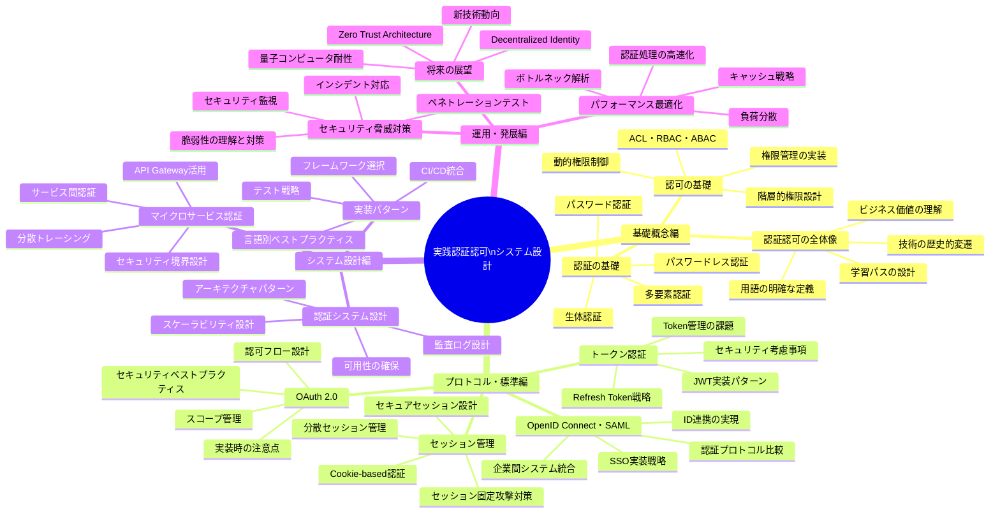
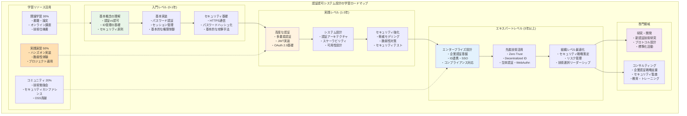

# はじめに

## 本書の目的

現代のWebアプリケーション開発において、認証・認可システムは避けて通れない重要な要素です。しかし、その実装は複雑で、セキュリティリスクも高く、多くの開発者が苦労しています。

本書「実践 認証認可システム設計」は、認証・認可システムの基礎から実装、運用まで、体系的に学ぶことを目的としています。単なる技術の解説にとどまらず、「なぜその技術が必要なのか」「どのような問題を解決するのか」という観点から、深い理解を促進します。

## 想定読者

本書は以下のような方々を対象としています：

- **Webアプリケーション開発者**（経験1-3年）
  - 認証・認可の基礎を体系的に学びたい方
  - セキュアな実装方法を知りたい方

- **システムアーキテクト志望者**
  - 認証基盤の設計について学びたい方
  - 技術選択の判断基準を身につけたい方

- **セキュリティエンジニア初級者**
  - 認証・認可のセキュリティ面を深く理解したい方
  - 脆弱性と対策について実践的に学びたい方

- **認証基盤の導入・運用担当者**
  - 既存システムへの導入を検討している方
  - 運用時の課題と対策を知りたい方

## 前提知識

本書を読むにあたって、以下の基礎知識があることを前提としています：

- 基本的なWeb技術（HTTP、Cookie、Session）
- プログラミング経験（1つ以上の言語）
- データベースの基礎知識
- 基本的なセキュリティ概念

これらの知識がない場合でも、必要に応じて補足説明を加えていますので、意欲的な初学者の方でも読み進められる構成になっています。

## 本書の特徴

### 「なぜ」から始まる深い理解

各技術や概念について、その歴史的背景と必要性から解説します。問題解決のコンテキストを明確にすることで、技術選択の判断基準を身につけることができます。

### 段階的な実装アプローチ

最小構成から始めて徐々に機能を追加していく実装アプローチを採用しています。各段階での学習ポイントを明示し、失敗例（アンチパターン）からも学べる構成です。

### 実務直結の包括的内容

実際のインシデント事例と対策、パフォーマンスとセキュリティのトレードオフ、運用フェーズまでカバーする実践的な知識を提供します。

### 豊富なサンプルコードと演習問題

各章には実践的な演習問題を用意し、理解を深められるようにしています。また、GitHubで完全なサンプルコードを提供しており、すぐに試せる環境を整えています。

## 本書の構成

本書は大きく4つのパートで構成されています：

**第I部: 基礎概念編（第1章〜第3章）**
- 認証・認可の全体像と基本概念を学習

**第II部: プロトコルと標準編（第4章〜第7章）**
- セッション管理、トークン認証、OAuth 2.0、OpenID Connectなどの標準技術を習得

**第III部: 実装編（第8章〜第10章）**
- 実際のシステム設計と実装パターンを学習

**第IV部: 応用編（第11章〜第13章）**
- セキュリティ脅威への対策、パフォーマンス最適化、将来の展望

各章には演習問題があり、付録として解答集も用意しています。

## 謝辞

本書の執筆にあたり、多くの方々にご協力いただきました。技術レビューをしていただいた皆様、サンプルコードのテストに協力いただいた皆様、そして日頃から技術的な議論を交わしてくださるコミュニティの皆様に、心より感謝申し上げます。

## フィードバック

本書の内容について、ご意見・ご感想がございましたら、GitHubリポジトリのIssueまたは著者のメールアドレスまでお寄せください。読者の皆様のフィードバックは、本書の改善に大いに役立ちます。

それでは、認証・認可システムの奥深い世界へ、一緒に踏み出しましょう。

2024年7月  
ITDO Inc.